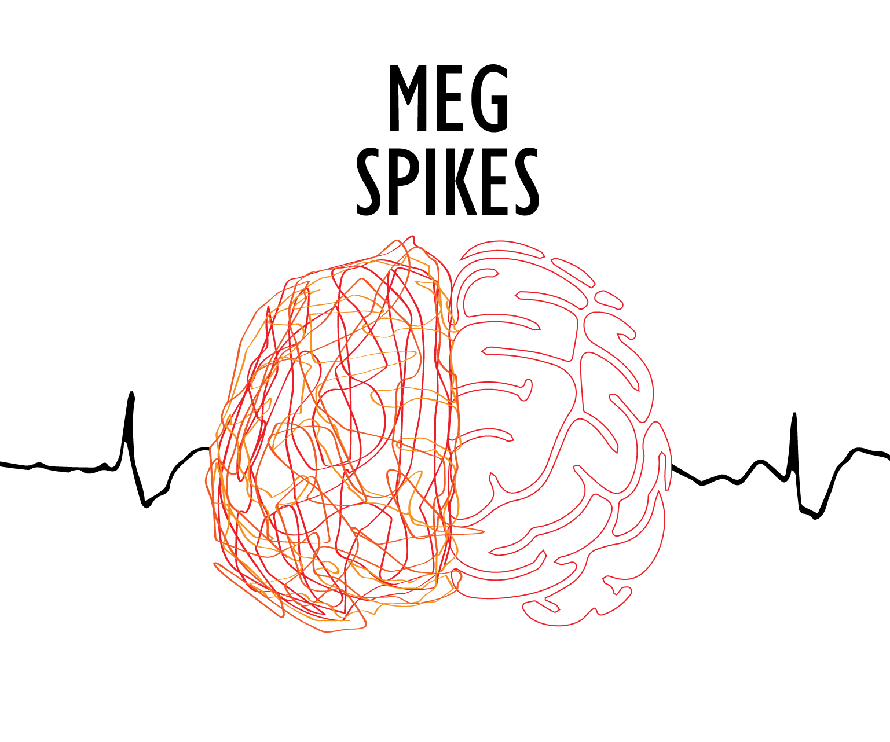
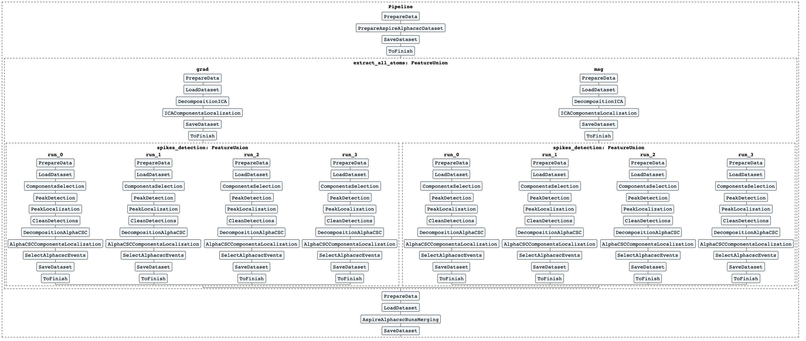
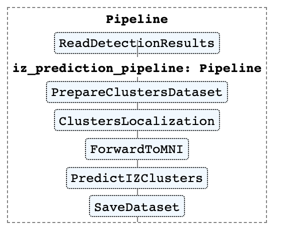

<p align="center">
</p>

[](https://github.com/MEG-SPIKES/megspikes/actions/workflows/python-package.yml)

[](CONDUCT.md)

## MEG-SPIKES

This repository contains functions for detecting, analyzing and evaluating epileptic spikes in MEG recording.

## Installation

The easiest way to install the package is using pip. You should clone the repository and install all dependencies:

```bash
git clone https://github.com/MEG-SPIKES/megspikes.git
cd megspikes/
pip install .

```

## Examples

Examples of how to use this package are prepared in the [Jupyter Notebooks](examples/).

- [0_simulation.ipynb](examples/0_simulation.ipynb): simulation that was used to test this package and in the other examples.
- [1_manual_pipeline.ipynb](examples/1_manual_pipeline.ipynb): localization of the irritative area when spikes are already detected.
- [2_aspire_alphacsc_pipepline.ipynb](examples/2_aspire_alphacsc_pipepline.ipynb): full spikes detection pipeline and visualization of each step.

## Documentation

### ASPIRE AlphaCSC pipeline

Full detection pipeline is presented on the figure below. The image was created using [Scikit-learn](https://scikit-learn.org) __Pipeline__ module.
<p align="center">
</p>

To reproduce this picture see [2_aspire_alphacsc_pipepline.ipynb](examples/2_aspire_alphacsc_pipepline.ipynb).

As is it depicted on the figure, ASPIRE-AlphaCSC pipeline includes the following main steps:

1. ICA decomposition
   1. ICA components licalization
   2. ICA components selection
   3. ICA peaks localization
   4. ICA peaks cleaning
2. AlphaCSC decomposition
   1. AlphaCSC atoms localization
   2. AlphaCSC events selection
   3. AlphaCSC atoms merging
      1. AlphaCSC atoms goodness evaluation
      2. AlphaCSC atoms selection

### Clusters localization and the irritative area prediction

Irritative zone prediction pipeline is presented on the figure below. The image was created using [Scikit-learn](https://scikit-learn.org) __Pipeline__ module.
<p align="center">
</p>

To reproduce this picture see [2_aspire_alphacsc_pipepline.ipynb](examples/2_aspire_alphacsc_pipepline.ipynb) and [1_manual_pipeline.ipynb](examples/1_manual_pipeline.ipynb).

### Parameters

[aspire_alphacsc_default_params.yml](megspikes/aspire_alphacsc_default_params.yml) includes all default parameters that were used to run spike detection using combination of ASPIRE [[2]](#2) and AlphaCSC [[1]](#1).

[clusters_default_params.yml](megspikes/clusters_default_params.yml) describes all the parameters that were used for the irritative area prediction based on the detected events and their clustering.

### Dependencies

#### Analysis

- alphacsc
- mne
- nibabel
- numpy
- scikit-learn
- scipy

#### Data storing

- pyyaml
- pandas
- openpyxl
- xarray
- netCDF4

#### Visualization

- matplotlib
- nilearn
- panel
- param
- notebook
- hvplot
- pyqt5
- pyvista
- pyvistaqt

#### Testing

- pytest

## Contributing

All contributors are expected to follow the [code of conduct](CONDUCT.md).

## References

<a id="1">[1]</a>
La Tour, T. D., Moreau, T., Jas, M., & Gramfort, A. (2018). Multivariate Convolutional Sparse Coding for Electromagnetic Brain Signals. ArXiv:1805.09654 [Cs, Eess, Stat]. http://arxiv.org/abs/1805.09654

<a id="2">[2]</a>
Ossadtchi, A., Baillet, S., Mosher, J. C., Thyerlei, D., Sutherling, W., & Leahy, R. M. (2004). Automated interictal spike detection and source localization in magnetoencephalography using independent components analysis and spatio-temporal clustering. Clinical Neurophysiology, 115(3), 508–522. https://doi.org/10.1016/j.clinph.2003.10.036
